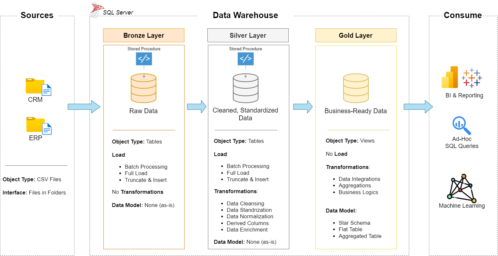
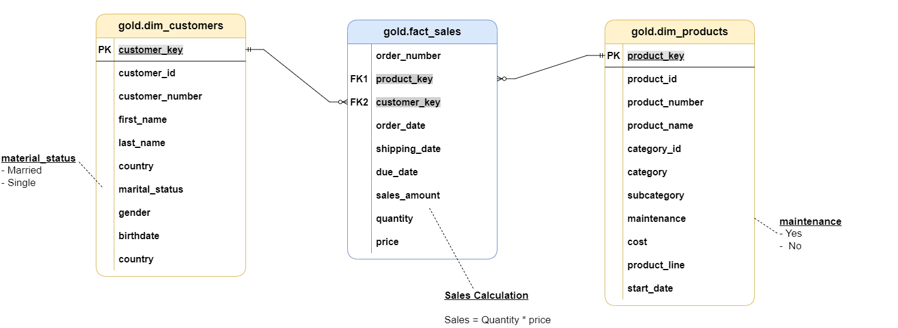

# 🏗️ SQL Data Warehouse Project

An end-to-end **SQL Server Data Warehouse** project implementing the **Bronze–Silver–Gold Medallion Architecture**. This project demonstrates how raw CRM and ERP data is ingested, transformed, validated, and modeled into an analytics-ready data warehouse using SQL Server.

---

## ✨ Features

- Bronze–Silver–Gold Medallion Architecture
- End-to-End ETL Pipeline
- Data Cleaning & Transformation
- Star Schema Data Modeling
- Dimension & Fact Views
- Data Quality Validation
- Analytics-ready Data Warehouse

---

## 🛠️ Tech Stack

- Microsoft SQL Server
- T-SQL
- SQL Server Management Studio (SSMS)
- ETL
- Data Warehousing
- Star Schema

---

## 🏛️ Data Warehouse Architecture

<p align="center">

</p>

---

## 🔄 ETL Pipeline

<p align="center">

</p>

---

## ⭐ Data Model

<p align="center">

</p>

---

## 📂 Project Structure

```text
sql-data-warehouse-project/
│
├── datasets/
│   ├── source_crm/
│   └── source_erp/
│
├── docs/
│   ├── architecture.png
│   ├── data_model.png
│   └── etl_flow.png
│
├── scripts/
│   ├── create_database.sql
│   │
│   ├── bronze/
│   │   ├── create_bronze_layer.sql
│   │   └── load_bronze.sql
│   │
│   ├── silver/
│   │   ├── create_silver_layer.sql
│   │   └── load_silver_data.sql
│   │
│   └── gold/
│       └── create_gold_views.sql
│
├── tests/
│   ├── quality_checks_silver.sql
│   └── quality_checks_gold.sql
│
├── README.md
└── LICENSE
```

---

## 🚀 Getting Started

Execute the SQL scripts in the following order:

1. `create_database.sql`
2. `bronze/create_bronze_layer.sql`
3. `bronze/load_bronze.sql`
4. `silver/create_silver_layer.sql`
5. `silver/load_silver_data.sql`
6. `gold/create_gold_views.sql`
7. `tests/quality_checks_silver.sql`
8. `tests/quality_checks_gold.sql`

> **Note:** Update the `BULK INSERT` file paths in `load_bronze.sql` before running the project.

---

## 📬 Contact

**Md Al Emran**

- 💼 LinkedIn: https://linkedin.com/in/mdalemrananas
- 🌐 Portfolio: https://mdalemrananas.github.io/PORTFOLIO-WEBSITE-MD-AL-EMRAN/
- 💻 GitHub: https://github.com/mdalemrananas

---

⭐ If you found this project useful, consider giving it a star.
